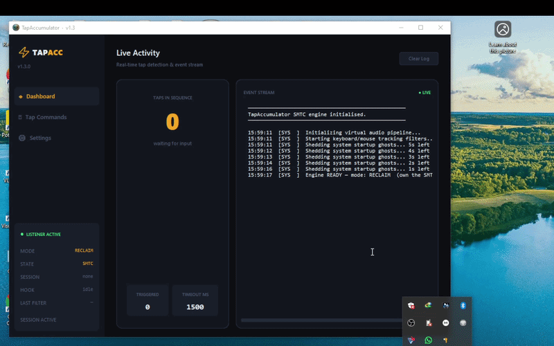
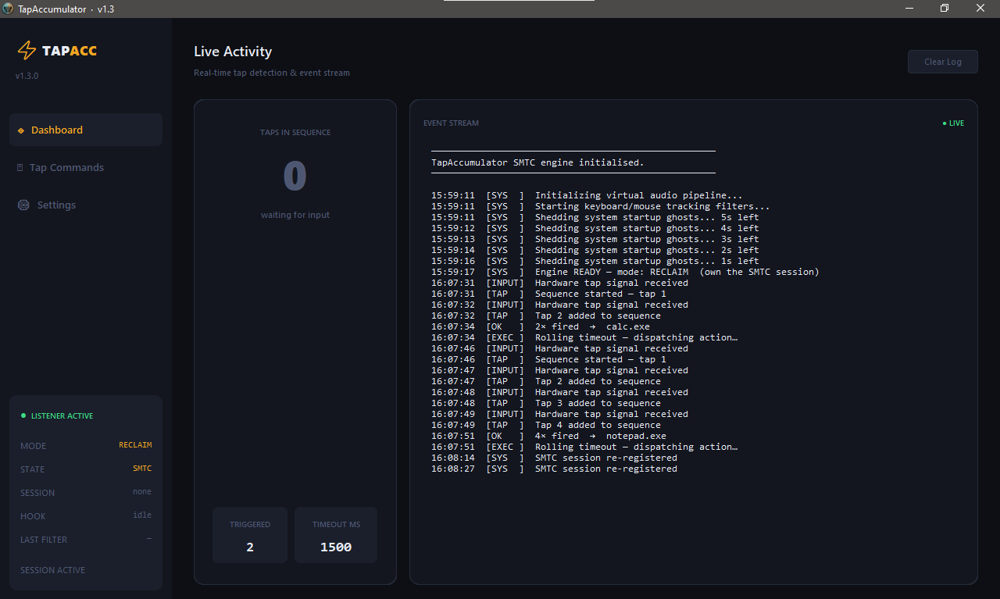
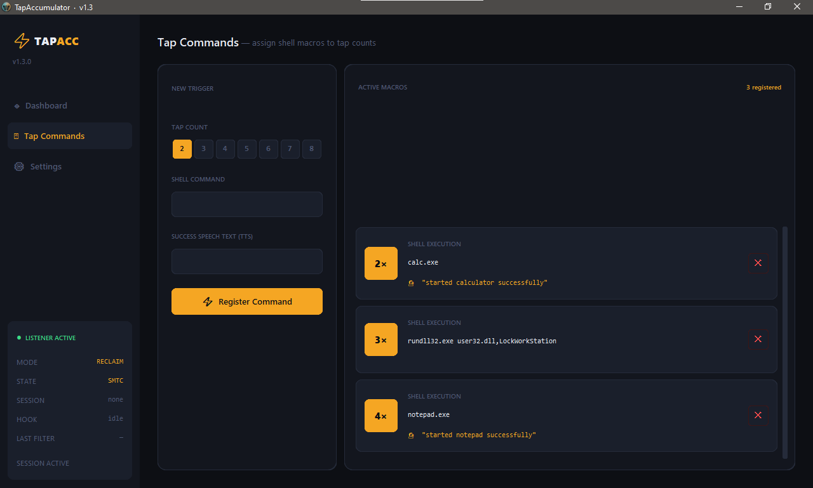
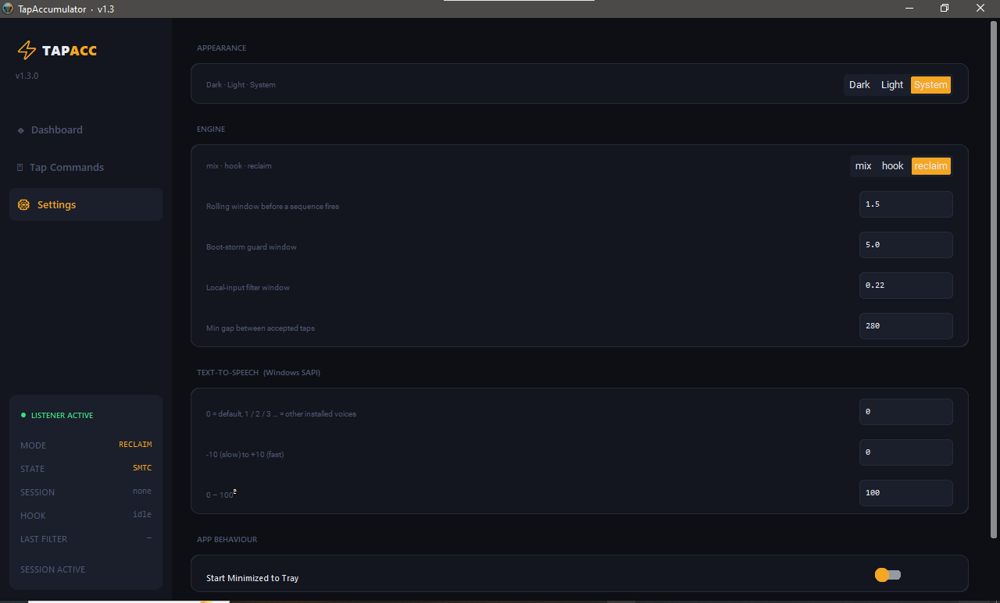

<div align="center">


# ⚡ TapAccumulator

### Turn your earbud button into a programmable multi-tap macro launcher

[](#)
[](https://python.org)
[](#license)
[](https://github.com/vyixor/tapaccumulator/stargazers)
[](https://github.com/vyixor/tapaccumulator/releases/latest)

*No drivers. No admin rights. No subscriptions. Just tap.*

---



</div>

---

## ⬇️ Download

| | |
|--|--|
| **Windows (no Python needed)** | [⚡ Download TapAccumulator.zip](https://github.com/vyixor/tapaccumulator/releases/latest) |
| **Run from source** | See [Installation](#installation) below |

The `.exe` is fully self-contained — extract the zip, run `TapAccumulator.exe`, done.  
Requires **Windows 10 or 11 · x64**.

---

## The Idea

Your Bluetooth earbuds have a button. Right now it only does one thing — play/pause. TapAccumulator intercepts that button, counts how many times you press it in quick succession, and fires a different command for each pattern. Completely hands-free.

```
Tap ×2  →  Lock the workstation
Tap ×3  →  Open Spotify
Tap ×4  →  Run a Python script
Tap ×5  →  Anything you want
```

It works **alongside** YouTube, Spotify, and any other media app — your content keeps playing uninterrupted while TapAccumulator silently counts your taps in the background.

---

## Features

- **Multi-tap sequences** — register distinct actions for 2 through 8 taps
- **Rolling timeout accumulator** — configurable silence window before a sequence fires
- **Three capture modes** — Mix (smart default), Hook (passive), Reclaim (exclusive)
- **Shell command execution** — run any executable, script, URL, or batch file
- **Voice confirmation (TTS)** — optional Windows SAPI speech text per macro
- **Modern dark UI** — tactical industrial design, live event stream, real-time tap counter
- **Always-on system tray** — custom earbud icon, toggle listener, reclaim focus on demand
- **First-run onboarding** — welcome modal with full usage guide, shown once
- **Hook mode warning** — notifies you of phantom-tap risk from auto-replay on startup
- **Persistent JSON storage** — macros and settings survive restarts, human-readable files
- **Boot-storm guard** — ignores spurious Windows media events during startup grace period
- **Non-destructive settings upgrades** — new keys merge in without overwriting your config

---

## Screenshots

| Dashboard | Tap Commands | Settings |
|-----------|-------------|----------|
|  |  |  |

---

## How It Works

```
Earbud button press
        │
        ▼
┌────────────────────────┐
│   Unified Input Filter  │  stamps every keyboard/mouse/scroll event
│   _should_ignore()      │  rejects signals within the threshold window
│   (pynput)              │  boot guard · debounce · input delta check
└───────────┬────────────┘
            │  clean signal confirmed
            ▼
┌────────────────────────┐
│   Rolling Accumulator  │  asyncio queue with configurable timeout
│   async_worker()       │  counts taps, waits for silence
└───────────┬────────────┘
            │  sequence complete
            ▼
┌────────────────────────┐
│   Macro Executor       │  fires shell command via subprocess.Popen
│   execute_action()     │  speaks confirmation text via Windows SAPI
└────────────────────────┘
```

---

## Capture Modes

| Mode | How it works | Best for |
|------|-------------|----------|
| **Mix** ⭐ | Registers a silent SMTC media session at startup. When another app steals media focus, attempts to hook into that session first. Falls back to re-registration if hook fails. | Everything — the default |
| **Hook** | Never fights for the media session. Passively attaches a `playback_info_changed` listener to whatever app is currently playing. Keyboard, mouse, and scroll timestamps filter local presses from genuine earbud taps. | YouTube or Spotify always running |
| **Reclaim** | Owns the SMTC session exclusively. Watchdog thread re-registers if another app steals it. | Nothing else playing in the background |

> **Mix** is the recommended default. It adapts automatically to whatever is playing without interrupting it.

> ⚠️ **Hook and Mix modes** may register phantom taps caused by browser auto-replay or media automation tools that toggle playback state programmatically. If this affects you, switch to **Reclaim** in Settings.

---

## Installation

### Option A — Prebuilt `.exe` (recommended)

1. Go to the [Releases page](https://github.com/vyixor/tapaccumulator/releases/latest)
2. Download `TapAccumulator.zip`
3. Extract it anywhere
4. Run `TapAccumulator.exe`

No Python. No installs. No dependencies.

### Option B — Run from source

#### Requirements

- Windows 10 or Windows 11
- Python 3.10 or newer
- A Bluetooth earbud or wireless headset with a media button

```bash
# 1. Clone the repository
git clone https://github.com/vyixor/tapaccumulator.git
cd tapaccumulator

# 2. Install dependencies
pip install -r requirements.txt

# 3. Run
python tapaccumulator.py
```

### `requirements.txt`

```
customtkinter>=5.2.0
winotify>=1.1.0
pynput>=1.7.6
pystray>=0.19.4
Pillow>=9.0.0
pywin32>=306
winsdk>=1.0.0b10
```

> All dependencies target Windows. This project does not run on macOS or Linux — it uses WinRT, SMTC, and Windows SAPI APIs.

---

## Usage

### Registering a Macro

1. Open **⌘ Tap Commands** in the sidebar
2. Select a tap count using the chip selector (2 – 8)
3. Enter a shell command in the **SHELL COMMAND** field
4. Optionally add a **SUCCESS SPEECH TEXT** phrase — spoken aloud by Windows SAPI when the macro fires
5. Click **⚡ Register Command**

### Command Examples

```bash
# Lock workstation
rundll32.exe user32.dll,LockWorkStation

# Launch applications
start spotify
notepad.exe
"C:\Program Files\MyApp\app.exe"

# Run scripts
python "C:\scripts\my_script.py"
cmd /c "C:\scripts\batch.bat"

# Open URLs
start https://github.com

# Volume and system
nircmd.exe mutesysvolume 2
shutdown /s /t 60
taskkill /f /im chrome.exe
```

---

## Configuration

All settings live in `%APPDATA%\TapAccumulator\settings.json` and can be edited directly. Changes are picked up on next launch. The Settings page in the UI exposes all values with descriptions.

```json
{
    "theme":                     "System",
    "capture_mode":              "mix",
    "timeout":                   1.5,
    "startup_grace":             5.0,
    "hook_threshold":            0.22,
    "tap_debounce_ms":           280,
    "aggressive_focus_recovery": true,
    "recovery_interval":         8.0,
    "tts_voice_index":           0,
    "tts_rate":                  0,
    "tts_volume":                100,
    "run_in_background":         true,
    "start_minimized":           false
}
```

| Key | Description | Default |
|-----|-------------|---------|
| `theme` | `"Dark"` · `"Light"` · `"System"` | `"System"` |
| `capture_mode` | `"mix"` · `"hook"` · `"reclaim"` | `"mix"` |
| `timeout` | Seconds of silence before sequence fires | `1.5` |
| `startup_grace` | Boot-storm guard window in seconds | `5.0` |
| `hook_threshold` | Local-input filter window in seconds | `0.22` |
| `tap_debounce_ms` | Minimum gap between accepted taps (ms) | `280` |
| `recovery_interval` | Reclaim watchdog polling interval (seconds) | `8.0` |
| `tts_voice_index` | SAPI voice: `0` = default, `1`/`2`/`3` = other installed voices | `0` |
| `tts_rate` | SAPI speech rate: `-10` (slow) → `+10` (fast) | `0` |
| `tts_volume` | SAPI speech volume: `0` – `100` | `100` |
| `start_minimized` | Start directly to system tray without showing window | `false` |

### Macro Storage

Macros are stored in `%APPDATA%\TapAccumulator\macros.json`:

```json
{
    "2": {
        "type": "shell",
        "command": "calc.exe",
        "speech_text": "Calculator opened"
    },
    "3": {
        "type": "shell",
        "command": "start spotify",
        "speech_text": "Opening Spotify"
    }
}
```

---

## Project Structure

```
tapaccumulator/
├── tapaccumulator.py     # UI, DataManager, tray, settings, modals
├── engine.py             # TapEngine — SMTC, hook, filter, accumulator, TTS
├── requirements.txt
├── build_exe.bat         # Nuitka build script → produces TapAccumulator.exe
├── README.md
├── LICENSE
├── icons/
│   ├── icon.ico          # Window title bar icon
│   └── icon.png          # README and general use
└── assets/
    ├── demo.gif
    ├── screenshot_dashboard.png
    ├── screenshot_macros.png
    └── screenshot_settings.png
```

### engine.py — TapEngine

The engine runs on a dedicated daemon thread with its own `asyncio` event loop, completely isolated from the UI thread.

| Method | Responsibility |
|--------|---------------|
| `_setup_our_session()` | Registers a silent looping `wmp.MediaPlayer` as a legitimate SMTC session |
| `_start_input_tracker()` | Hooks keyboard, mouse clicks, and scroll wheel via `pynput` to stamp `_last_input_time` |
| `_should_ignore()` | Unified three-layer filter: boot guard → debounce → input delta |
| `_setup_session_watcher()` | Attaches to `GlobalSystemMediaTransportControlsSessionManager`, hooks `playback_info_changed` |
| `_respond_to_session_change()` | Mix mode decision tree: hook new session → or re-register ours |
| `async_worker()` | Rolling-timeout asyncio queue — counts taps, dispatches on silence |
| `_execute_speech_pipeline()` | COM-safe SAPI TTS via `pythoncom.CoInitialize()` in a short-lived thread |

---

## System Tray

TapAccumulator places a custom earbud icon in your system tray at startup — it is always present whether the window is open or closed.

| Action | Result |
|--------|--------|
| **Show TapAccumulator** | Brings the window to the foreground |
| **Toggle Earbud Listener** | Pauses or resumes tap detection, shows Windows notification |
| **Reclaim Media Focus** | Re-registers the SMTC session to bring media button routing back to TapAccumulator |
| **Exit** | Fully closes the application |

Closing the window hides it to tray. It does not terminate the engine.

---

## Troubleshooting

**Taps aren't being detected**
- Make sure the startup grace period (default 5s) has elapsed — the event stream will show `Engine READY` when it's active
- Try switching capture mode to `reclaim` if `mix` isn't working with your device
- Check `%APPDATA%\TapAccumulator\tapaccumulator.log` for detailed engine output

**Taps are registering twice**
- Increase `tap_debounce_ms` in Settings (try `350` or `400`)
- Some Bluetooth drivers fire two events per press — the debounce guard handles this but may need tuning for your adapter

**Phantom taps when YouTube auto-replays**
- Expected in `hook` and `mix` modes — see the hook warning on startup
- Switch to `reclaim` mode in Settings for exclusive media button control

**Speech text not playing**
- Confirm `pywin32` is installed: `pip install pywin32`
- Try a different `tts_voice_index` in settings — index 0 is the Windows default voice
- Check the log for `TTS Thread Failure` errors

**App doesn't appear in taskbar**
- It's minimized to the system tray — look for the amber earbud icon in the notification area
- Right-click it and select **Show TapAccumulator**

---

## Building from Source

A Nuitka build script is included to produce a standalone `.exe`:

```bat
build_exe.bat
```

Output: `dist\TapAccumulator.exe`

Requires Nuitka and MSVC (Visual Studio Build Tools). The script installs Nuitka automatically if not present.

---

## Contributing

Pull requests are welcome. Please open an issue first to discuss any significant changes.

Areas where contributions would be most useful:

- Testing across different Bluetooth earbud brands, adapters, and drivers
- Additional action types — HTTP webhooks, AutoHotkey integration, key simulation
- macOS/Linux equivalent using platform-native media key APIs

---

## License

MIT License — free for personal and commercial use.

---

<div align="center">

Built by [vyixor](https://github.com/vyixor)

**If TapAccumulator saved you a trip to the keyboard, a ⭐ star is appreciated.**

</div>
